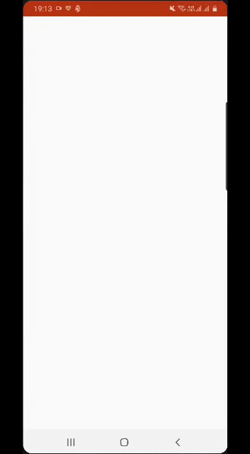
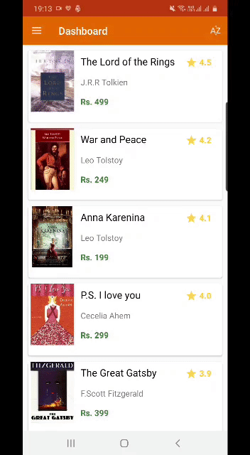
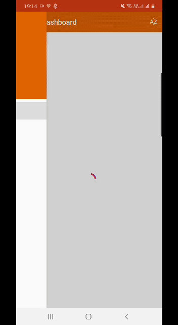
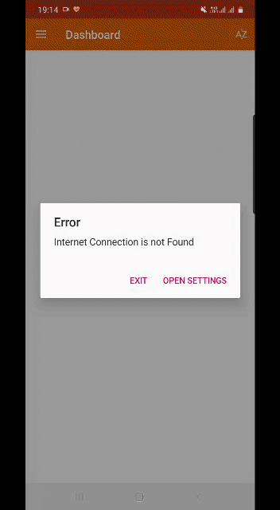

# BookHub

A basic Android app developed in Kotlin that fetches data from the internet, has a navigation drawer and makes use of fragments and activities.

The book list can be sorted using the button in the upper right corner. If two books have the same rating, they'll be shown an alphabetical order.

There's also a fragment called 'Favourites' which is totally functional. The color and text in the button saying 'Add to favourites' changes on clicking on it.

When the device doesn't have network connection, the app asks the user to either exit or connect to network by opening the settings.

